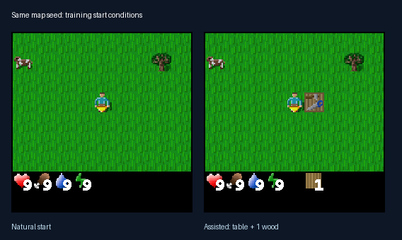
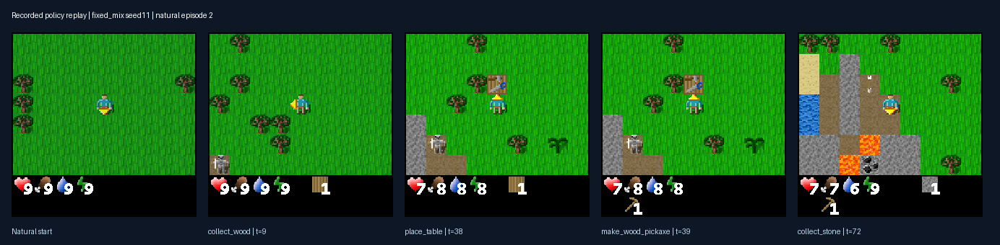
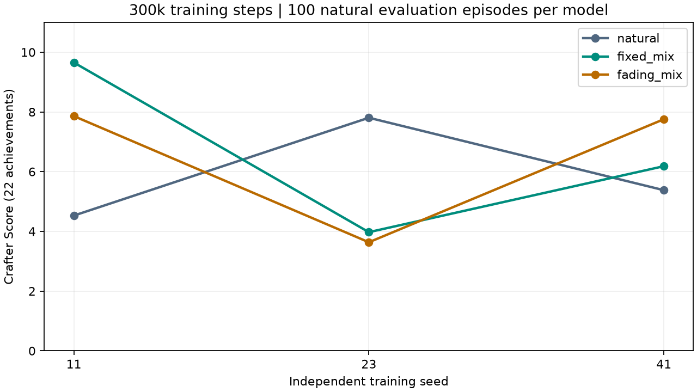

# CraftScaffold｜从练习到独立生存

> **当前策略更新（2026-10-07）**：同批与逐级学习统一改用八项单技能课程及辅助主线奖励过滤。详见[当前训练策略](docs/current-training-strategy.md)。本次同批模型从212539步续至400000步；下面的3×3结果与演示属于旧协议，不能作为新版效果证据。新版runtime实现尚未移植到本仓库的portable入口。

**基于DreamerV3 + Crafter的强化学习课程项目：在带帮助的场景中练习，再检验智能体能否在正常世界里独立生存和制作工具。**

我们研究的工程问题是：**相同训练预算下，什么时候提供帮助，能让最终游戏能力更好？**
复用成熟的世界模型强化学习算法，自行实现辅助出生场景、训练日程、断点恢复与评估审计。
目标是做出可运行、可解释、有对照数据的游戏学习系统，而非宣称新算法或通关全部成就。

截至2026-10-06，原始 **3种方法 × 3个训练种子** 全部完成，每个模型训练300,000步、评估100个自然场景，共900回合。
综合成绩平均上有正向收益，但跨训练种子不稳定，尚未获得稳定的高级制作能力。

## 一眼看懂项目

Crafter是开源二维生存游戏，包含采集、战斗、生存和工具制作等22项成就。
原始3×3实验训练的是完整游戏奖励下的多技能策略，**并非只训练木镐**；木镐是预设的重点观察指标。



上图是旧协议同一地图种子下的真实环境画面。旧辅助只在训练时改变出生条件：玩家右侧放置工作台、木头库存设为1。
智能体仍要自己选择动作；没有专家动作标签，没有直接赠送工具、成就、奖励或无敌状态。
这属于**人工设计初始状态课程下的强化学习**，不称为严格无监督学习。



上图来自固定辅助模型seed11的自然场景评估第2回合：正常出生 → 采木 → 放工作台 → 制作木镐 → 采石。
这是按“首个同时完成木镐和采石的回合”选取的成功案例，**不是平均表现或成功率证明**。
图片通过重放记录动作生成，全回合221步的奖励、终止和22项成就逐步匹配原日志；[来源与校验](docs/results/demo-provenance.json)。

## RL体现在哪里？

~~~text
游戏图像、环境奖励、回合标志
           ↓
经验池 → DreamerV3世界模型 → 模型内想象轨迹
                               ↓
                         actor / critic学习
                               ↓
                         动作返回真实游戏
~~~

我们复用DreamerV3的网络、损失与想象学习机制，当前改动训练环境的初始分布、日程和辅助回合奖励过滤；自然回合奖励不变。
actor和critic没有额外结构化特权输入；场景帮助通过正常图像可见。
诊断器读取库存与成就用于统计，不能作为策略输入。

## 三种训练安排

每个模型从头训练300,000个保留环境动作，分为120个区块，每区块2,500动作。

| 方法 | 初始场景安排 | 训练中的辅助动作 |
|---|---|---:|
| natural（自然训练） | 全程正常出生 | 0 |
| fixed_mix（固定辅助） | 每4个区块有1个辅助区块 | 75,000 |
| fading_mix（前置后撤除） | 前150k动作一半辅助；后150k全部正常 | 75,000 |

“撤除”是两阶段安排，**不是平滑衰减**。辅助区块内死亡后仍按辅助条件出生。
三组都有相同的区块边界截断和稳定对象排序；截断不作为死亡终局。因此natural是本项目协议内基线，不等同上游论文配置。

训练种子11、23、41代表三次独立随机训练运行，**不是只在三个固定世界训练**；每次运行包含多个随机世界。
最终模型使用共同的100个自然评估场景，采用固定随机数的sampled eval，而非argmax。
所有原始最终权重冻结后才进行该轮评估，没有按这100回合选择原实验checkpoint。

## 当前3×3初步结果

### 综合能力：标准Crafter Score

每项成就的成功率为p（0–100），每个模型的Score为exp(mean(log(1+p)))−1，覆盖全部22项。
先计算各模型分数，再对三个训练种子等权平均；不是把900回合冒充900次独立训练。

| 方法 | seed11 | seed23 | seed41 | 三种子均值 |
|---|---:|---:|---:|---:|
| 自然训练 | 4.528 | 7.805 | 5.379 | **5.904** |
| 固定辅助 | 9.653 | 3.973 | 6.182 | **6.603** |
| 前置后撤除 | 7.859 | 3.635 | 7.755 | **6.416** |



固定辅助相对自然训练平均增加0.699分（约11.8%），撤除辅助增加0.513分（约8.7%）。
两种辅助在2/3个配对训练种子上优于自然训练，在另一个种子上落后。
因此，**平均综合效果为正，但不能声称稳定优越**；也不能只凭一个失败种子否定整体收益。

### 同时保留未改善的指标

木镐是原协议预设主要指标，22项综合分析用于补充全局评价，不能用它事后替换原指标来宣称原假设已证实。

| 指标（三种子均值） | 自然训练 | 固定辅助 | 前置后撤除 |
|---|---:|---:|---:|
| 木镐制作成功率 | 40.33% | 39.00% | 29.33% |
| 采石成功率 | 11.67% | 19.67% | 13.67% |
| 每回合不同成就数 | 6.30 | 6.22 | 6.53 |
| 每回合原始回报 | 5.38 | 5.31 | 5.62 |

木镐成功率的三次独立结果分别为：自然32/41/48%，固定65/1/51%，撤除42/0/46%。
综合Score、单项成功率、成就数与回报衡量不同侧面，不能互相替代。
铁与钻石采集、铁工具等仍未成功；撤除组平均Score略低于固定组，但不能将完整日程差异单独归因为“遗忘”或“依赖”。

**现阶段结论**：人工辅助值得继续作为工程候选，收益主要体现为部分技能覆盖和综合Score的改善；一致性与高级技能仍是短板。
三个种子仅提供课程级初步证据，不支持SOTA、统计显著性或算法首创声明。

可在安装后运行 ./python.sh tools/verify_results.py，无需模型或GPU，重新计算全部九份成绩。

可复核数据：[九模型指标与检查点哈希](docs/results/formal-300k.json) · [900回合成就与回报](docs/results/episodes-300k.json) · [全部22项成功率CSV](docs/results/achievements-300k.csv)。
九次训练共保留270万动作，实际完成2,715,928动作，其中恢复重复15,928动作；训练尝试累计约50.63小时，不含全部开发与修复成本。
后期部分运行使用traceguard-v1移除未启用追踪的多余同步；短程等价检查通过，但不能视为所有长轨迹逐位等价的证明。

## 当前工程路线

已取消旧六路续训任务。现在从上述原始300k模型中，每种方法选择综合Score最高的一个候选：
自然seed23、固定seed11、撤除seed11，分别继续到350k，保留完整经验池和优化器状态，并在共同的新自然场景中评估。

这是**选优后的工程迭代**，不是新的无偏三种子方法比较。旧评估已用于选模型，后续成绩必须与本表分开报告；
迭代使用的场景是开发集，最终展示模型还需要独立留出评估。本仓库目前不宣称续训收益，视频与PPT尚未制作。

## 与已有工作和自主实现的关系

初始状态课程与撤除帮助已有研究先例，本项目不是首个DreamerV3/Crafter课程项目。
我们没有改造DreamerV3算法；自主工作是场景适配、等辅助动作数日程、行为机会诊断、完整断点恢复、资源守护和结果审计。

| 相关工作 | 重合点 | 本项目范围 |
|---|---|---|
| [Reverse Curriculum](https://proceedings.mlr.press/v78/florensa17a.html)、[RFCL](https://github.com/StoneT2000/rfcl) | 从较容易初始状态学习 | 无示范轨迹；一个手工辅助场景；固定日程，不是RFCL复现 |
| [SCOUT](https://arxiv.org/html/2607.26417v1) | 辅助reset、撤除与自然起点评估 | 本项目没有自适应辅助控制 |
| [DiCode](https://github.com/konstantinosmitsides/dreaming-in-code) | Craftax制作辅助任务 | 本项目只干预初始场景，保留原奖励 |
| [dreamer-sc](https://github.com/abhik-roy/dreamer-sc) | DreamerV3/Crafter低预算课程 | 本项目不增加目标条件输入或重写奖励 |

[独立相关工作审查及证据边界](docs/related-work.md)。未找到完整协议完全相同的成品，不等于证明“无人做过”。

同等辅助动作数不保证同等重置次数与制作机会；两种日程同时改变前期密度、经验年龄和后期帮助。
当前结果也不是完整样本效率曲线。以上限制随正向结果一起保留。

## 快速开始（Linux / Python 3.11）

Windows 请使用 WSL2 Linux 环境；不支持原生 Windows 训练。
将仓库克隆到**自己的可写目录**，不需要原作者服务器、SSH key、固定 GPU UUID 或外部模型目录。

```bash
git clone https://github.com/TwilightGlimmer/craft-scaffold.git
cd craft-scaffold
bash setup.sh cpu
./python.sh tools/doctor.py
./python.sh tools/validate_runtime.py
```

CPU 路径用于安装、配置和环境测试，不开展正式训练。安装只写仓库内的 `.venv` 与 `.artifacts`，不修改系统 Python。
默认需要 `python3.11`，可通过 `CRAFT_BOOTSTRAP_PYTHON` 指定个人 Python 3.11。
首次安装需要网络。依赖分为 [CPU](requirements/cpu.txt) 和 [CUDA](requirements/cuda.txt)；CPU 依赖闭包已固定在 constraints.txt；CUDA 额外驱动运行库由安装器解析，运行时记录全部实际版本。

### GPU 配置与目标机器验收

在有可用 NVIDIA GPU、兼容 CUDA 12 JAX 驱动的 Linux 机器上：

```bash
bash setup.sh cuda
cp .env.example .env.local
# 编辑 .env.local，选择个人存储目录和空闲 GPU
./python.sh tools/validate_runtime.py --gpu
./python.sh scripts/curriculum_formal_worker.py
```

GPU 验收是明确的耗时操作：检查设备、400 步连续/两次恢复一致性、5,100 步课程边界预检、100 回合开发评估。
验收通过后才生成当前机器的 `local-validation.json`，正式调度器拒绝借用历史验收解锁训练。
若验收中断，换一个新的 `CRAFT_RUN` 重新验收，避免把旧产物误认为新测试结果。
不要在另一训练管理程序仍占用目标 GPU 时启动。

**可配置项**（可写进被 Git 忽略的 `.env.local`，这是可信 Bash 配置）：

| 变量 | 默认值 | 用途 |
|---|---|---|
| CRAFT_DATA_ROOT | 仓库/.artifacts | 模型、报告、日志和缓存根目录 |
| CRAFT_RUN | portable-v2 | 实验版本名，只允许字母、数字、下划线和连字符 |
| CRAFT_GPU | 0 | 单个 GPU 编号或 UUID |
| CRAFT_THREADS | 2 | CPU 线程和亲和性上限 |
| CRAFT_PYTHON | 仓库/.venv/bin/python | 可选个人 Python 环境 |

所有命令统一经过 `./python.sh`。源码、配置、依赖或资源设置改变时使用新实验版本，不能覆盖旧源码锁。
默认单任务、20 GiB 显存和16 GiB进程树内存上限；管理程序检测停滞后从完整检查点分段恢复。
断开终端会影响前台管理程序；长训练请使用自己的 tmux 等会话管理方式。

## 输出、恢复与审计

输出在 `CRAFT_DATA_ROOT` 下按版本隔离：

```text
models/<run>/<method>-seed<seed>/    # 权重、replay、环境/随机数状态、真实交互账本
reports/<run>/                     # 本机验收、源码锁、状态、逐回合评估
logs/<run>/                        # 训练、评估和恢复日志
cache/  tmp/                       # 安装与运行缓存
```

正式矩阵入口串行训练三个方法与三个种子，按 10k 保留动作分段，保存模型、优化器、环境、policy carry、采样器与待处理更新。
管理程序只恢复完整检查点，超过资源上限或连续五次无进展会失败退出，保留诊断信息。
正式评估与开发评估使用不同随机数命名空间，不按正式测试成绩选 checkpoint。

仅加载可信来源的 pickle 检查点。跨依赖版本、跨硬件的逐位一致性没有保证。

## 代码导航

- `scripts/curriculum_env.py`：课程和环境恢复；`curriculum_adapter.py`：Dreamer 接口。
- `curriculum_train.py`、`curriculum_evaluate.py`：训练与固定评估。
- `analyze_curriculum_evaluation.py`：逐步机会/尝试/失败原因审计。
- `exact_replay.py`、`training_runtime.py`：完整恢复。
- `project_runtime.py`、`resource_guard.py`：可移植路径、源码锁与资源限制。
- `configs/train.yaml`：完整模型配置；`configs/protocol.json`：可移植版本协议模板。
- `tools/doctor.py`、`tools/validate_runtime.py`、`tests/`：环境及目标机器验收。

## 版本与验证状态

原3×3正式实验已完成，基于提交0ecf164及经过审计的traceguard-v1运行时修订。
本版本为 **portable-v2 工程迁移**，不修改原实验文件、结果或 release lock。
旧服务器验收与锁文件已移出发布目录，不能用历史通过状态代替新机器验收。
原始绝对路径仍可能存在于旧 Git 历史；它们不是凭据，本次没有重写历史。

验证范围见 [工程迁移说明](docs/portability.md)。本版本提供安装和验收入口，但不把 CPU 检查冒充新机器 GPU 端到端复现。

## 发布与许可

模型、运行日志、环境、缓存、临时文件和本机配置不入库；脱敏的900回合结果和演示图片保存在docs/results与docs/assets。
提交前运行 `./python.sh tools/check_publication.py` 并审阅 staged diff。
不使用 `git add -f` 纳入运行目录。检查器不是绝对的秘密检测保证。

上游 [DreamerV3](https://github.com/danijar/dreamerv3) 固定于
`e3f02248693a79dc8b0ebd62c93683888ddaccfe`，保留 [MIT 许可证](dreamerv3/LICENSE) 和 [集成补丁](docs/upstream-integration.patch)。
[Crafter](https://github.com/danijar/crafter) 1.8.3 通过依赖提供游戏和素材。
见 [第三方声明](THIRD_PARTY_NOTICES.md)。本组新增代码尚未选择开源许可证，公开可读不等于授予再分发授权。
